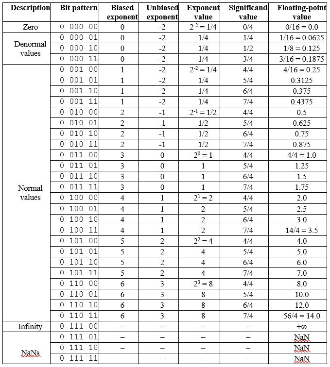

# Code Optimization: Assignment N°4 Report

###### Duy Le - Cédric Léonard, 29/11/2021

### Introduction
The assignment is about understanding the floating-point computations and doing an experiment with a new matrix multiplication algorithm with the BLAS library.

### Question N°1



​			Figure N°1: Screenshot of *Form.docx* filled with 6-bits floating-point format based on the IEEE standard

#### Question N°2

Original number: -275.875

1. Convert its positive version in classic binary:  $275 = 256 + 16 + 2 + 1$   and $0.875 = 0.5 + 0.25 + 0.125$ => $275.875 = 100010011.111_2 \times 2^0$
2. Normalize it: $275.875 = 1.00010011111_2 \times 2^8$
3. Compute the exponent: $E = 8+127 = 135 = 128 + 4 + 2 + 1 = 10000111_2$
4. Compute the mantissa (drop the leading 1-bit and fill with insignificant 0-bits): $f = 0001001111 1\space000000000 000$ 
5. Don't forget the sign bit: $S = 1$ for negative numbers

Result: $1 \space 10000111 \space 0001001111 1000000000 000$

If we verify our result with the formula $(-1)^S \times 1.f \times 2^{E-127}$ we get:

$(-1)^1 \times 1.0776367188 \times 2^{8} = -275.875$

#### Question N°3

The smallest single-precision floating-point value $X.0$ for which $X+1.0f = X$ is  $X.0 = 16777216.0 = 2^{24}$. This makes sense because in IEEE-754 the mantissa is only made of 23 bits, so whenever we hit $16777216$ we don't have any more digits to encode this $1.0f$ increase. Therefore, in IEEE-754 the next number after $16777216$ is $16777218$.

It's possible to deduce that with a pen and some paper but I was lazy and wrote a program, Cf. *smallest_float.c*.


​																Figure N°2: *smallest_float.c* output

#### Question N°4

````C
int main()
{
    float f = 0.1f;
    float sum1 = 0.0f;

    // Calculate the result by adding
    for (int i = 0; i < 10; ++i)
        sum1 += f;
    // Calculate the result by multiplying
    float sum2 = f * 10.0f;
    // Print results, with a third calculation of the value
    printf("sum1 = %1.15f, sum2 = %1.15f, sum3 = %1.15f\n",
           sum1, sum2, f*10.0);
    return 0;
}
````

The output of this program is:

`sum1 = 1.000000119209290, sum2 = 1.000000000000000, sum3 = 1.000000014901161`

We can see that the only result corresponding to the "answer" is `sum2`. This is because we explicitly precise that we are doing multiplication with float operands, therefore the compiler is able to use the proper instruction.

`sum1` is easy to explain why it is that different from `sum2`, we proceed via 10 additions leading to 9 temporary results, each rounded. For example, the second computation should give us $0.2$, but in the binary representation, $0.2$ is encoded as  $0.00110011[0011]_2$  ... if we had an infinite number of bits which we do not. Therefore,  $0.2$ is rounded and introduces the first error in our result.

`sum3` is a bit more tricky, I would say that the slight difference in the result comes from the fact that we didn't specify that $10.0$ was a float constant, so it has been encoded as with `double` precision and then converted in a float before being multiplied which leads to the "error".

### Question N°5

##### a. The program was compiled and run using the following command:

````bash
module purge
module load OpenBLAS
make mm_blas
srun -N 1 mm_blas 4000
````

The results were correct, the matrix multiplication with BLAS library produces the same results as the other algorithms that were implemented previously.
The table below shows the execution time of this algorithm compared to previous implementations. For matrix multiplication with blocks, the block sizes that are chosen for the comparison were 40 and 250.

|    with -O3 flag   | $1000 \times 1000$ | $2000 \times 2000$ | $3000 \times 3000$ | $4000 \times 4000$ |
| ------------------ | ------------------ | ------------------ | ------------------ | ------------------ |
| (i, j, k)          | 1.34               | 12.71              | 51.76              | 205.72             |
| (i, k, j)          | 0.34               | 4.64               | 21.34              | 53.80              |
| (j, k, i)          | 1.49               | 15.93              | 60.23              | 335.67             |
| (i, j, k) (bs 40)  | 0.92               | 7.01               | 23.77              | 56.26              |
| (i, k, j) (bs 40)  | 0.35               | 3.00               | 10.37              | 24.81              |
| (j, k, i) (bs 40)  | 0.86               | 7.00               | 23.68              | 58.18              |
| (i, j, k) (bs 250) | 1.12               | 8.52               | 28.19              | 69.07              |
| (i, k, j) (bs 250) | 0.31               | 2.49               | 8.41               | 20.04              |
| (j, k, i) (bs 250) | 0.93               | 10.24              | 25.59              | 100.19             |
| mm_blas            | 0.08               | 0.40               | 1.18               | 2.71               |

##### b. Calculate how many floating-point operations per second (FLOPS) was achieved

According to the source code, BLAS xgemm calculates $C = \alpha*A * B + \beta*C$, where $A$, $B$, and $C$ are 2D matrices
and $\alpha$ and $\beta$ are scalar values. There are 4 floating-point operations, 3 multiplication and 1 addition.
For a matrix size $N = 1000$, the matrix multiplication algorithm has three nested loops, with increment values from 0 to 1000. Therefore:

The number of floating-point operations executed is $4\space1000\space1000\space1000 = 4*10^9$.
The measured time for the optimized program using OpenBLAS library: 0.08 s.

The floating-point operations per second (FLOPS) is $50 \times 10^9$.
